# openlane-soc-design

RTL-to-GDSII physical design flow using OpenLANE & Sky130 PDK | VSD SoC Design and Planning Workshop.

## Digital VLSI SoC Design and Planning — RTL to GDSII

> A 2-week hands-on workshop on complete RTL-to-GDSII flow for digital VLSI SoC design, organised by **VSD (VLSI System Design)** in collaboration with NASSCOM. This repository documents my learning, lab outputs, and key takeaways from each day.

# Day 1: Exploring the Basics of SoC Design and Open-Source EDA

As I dive into the world of physical design, I wanted to document my foundational understanding of how chips are actually built and the open-source tools that make this possible. Here are my key takeaways from getting started with the RTL-to-GDSII flow.

---
## My Understanding of the Chip Package

When I look at an embedded board and point to the black square I usually call the "chip," I'm actually just looking at the **package**—the protective plastic or ceramic casing. The *real* silicon chip sits right in the centre of this package. It communicates with the outside world through **wire bonding**, which are incredibly tiny wires connecting the chip's internal pads to the pins I see on the outside of the package.

### Zooming Inside: Core, Pads, and the Die

If I zoom into the chip itself, I can see how the layout is structured:
*   **Pads:** Placed around the periphery, these act as the gateways. All signals passing between the chip and the external world go through here.
*   **Core:** The region enclosed by the pads. This is the heart of the chip where all the actual digital logic lives. 
*   **Die:** Together, the core and the pads form the die, which is the fundamental manufacturing unit of the chip.

### Key Terminology I'm Tracking
*   **Foundry:** The physical fabrication plant where the chips are actually manufactured.
*   **Foundry IPs:** Specialized IP blocks (like PLLs or SRAMs) that require deep, process-specific knowledge to implement properly.
*   **Macros:** Reusable, purely digital logic blocks.

---

## From Software to Silicon: The ISA Bridge

I find the transformation from a high-level program to physical hardware really fascinating. When a C program runs on a chip, it goes through a multi-layer transformation:

1.  My C code is first compiled into **RISC-V assembly** (or whichever Instruction Set Architecture I'm targeting).
2.  The assembler then converts those instructions into **binary machine code** (0s and 1s).
3.  For the hardware to understand this, there needs to be an **RTL implementation** of that specific ISA.
4.  Finally, that RTL is synthesized and pushed through the full **PnR (Place and Route)** flow to become a physical hardware layout.

Ultimately, the system software stack (OS → Compiler → Assembler) acts as the crucial bridge translating what I write as a programmer into what the hardware physically executes.

---

## Why Open-Source EDA is a Game Changer

For a fully open-source ASIC design flow to exist, I learned that we need three critical components:
1.  **RTL Designs:** Open-source hardware descriptions (like those found on opencores.org).
2.  **EDA Tools:** The software for synthesis, placement, routing, and verification.
3.  **PDK Data:** The Process Design Kit, which contains the manufacturing rules and standard cell libraries specific to a foundry's process node.

Historically, PDKs were closely guarded secrets distributed only under strict NDAs, making actual chip design practically inaccessible to hobbyists or independent students like me. That all changed in **June 2020**, when Google and SkyWater Technology released the **Sky130 PDK**. As the world's first open-source PDK, it was a massive milestone that blew the doors open for the VLSI community.

---

## OpenLANE and the Automated RTL to GDSII Flow

To bring my designs to life, I'm using **OpenLANE**. It's an automated, open-source flow that wraps around several EDA tools to take an RTL netlist all the way to a final GDSII layout file (the file you'd send to a foundry). 

Here is a breakdown of the specific tools OpenLANE uses under the hood for each stage of the flow:

| Flow Stage | Open-Source Tool(s) Used |
| :--- | :--- |
| **Synthesis** | Yosys, ABC |
| **Floorplan & PDN** | OpenROAD |
| **Placement** | OpenROAD |
| **CTS (Clock Tree Synthesis)** | TritonCTS |
| **Routing** | FastRoute, TritonRoute |
| **SPEF Extraction** | OpenRCX |
| **GDS Streaming** | Magic, KLayout |
| **Timing Analysis** | OpenSTA |
| **DRC & LVS (Physical Verification)** | Magic, Netgen |

## Lab Session: Interactive OpenLane Flow & Synthesis

To get hands-on with the flow, I needed to launch OpenLane in interactive mode. This allows for step-by-step execution and inspection of the design at each individual stage.

### 1. Invoking the OpenLane Environment
First, I navigated to the working directory, mounted the Docker container, and launched the tool.

```bash
# Navigate to the OpenLane directory
cd ~/Desktop/OpenLane

# Mount the Docker container
make mount

# Launch the OpenLane flow in interactive mode
./flow.tcl -interactive

### 2. Package Inclusion and Design Preparation
Once inside the OpenLane interactive shell (`%` prompt), I loaded the required OpenLane packages and set up my specific design (`picorv32a`). 

```tcl
# Require the OpenLane package
package require openlane 0.9

# Prepare the picorv32a design
prep -design picorv32a
```
*Note: The `prep` command creates a new run directory tagged with the current date and time, and merges the technology LEF and cell LEF files into a single `merged.lef` file.*

**Terminal State Before Synthesis:**


### 3. Logic Synthesis
With the design prepared, I ran logic synthesis using Yosys. This step translates the RTL (Verilog) into a logic gate-level netlist mapped to the Sky130 standard cell library.

```tcl
run_synthesis
```
**Synthesis Execution & Completion:**


### 4. Calculating the Flop Ratio
After synthesis completed, I analyzed the generated netlist statistics in the terminal to determine the Flop Ratio. This ratio represents the proportion of D-Flip Flops (DFFs) relative to the total number of cells in the synthesized design.

The formulas used for this calculation are:

$$ \text{Flop Ratio} = \frac{\text{Number of D Flip-Flops}}{\text{Total Number of Cells}} $$

$$ \text{Percentage of DFFs} = \text{Flop Ratio} \times 100 $$

**Finding the Total Number of Cells:**

**Finding the Number of D-Flip Flops (`sky130_fd_sc_hd__dfxtp_2`):**


Based on my specific terminal output, I identified the following values:

*   **Total Number of Cells:** 15,762
*   **Number of D-Flip Flops (`sky130_fd_sc_hd__dfxtp_2`):** 1,613

Plugging my values into the formula:

$$ \text{Flop Ratio} = \frac{1613}{15762} = 0.1023347 $$

This means my design has a **Flop Ratio of 10.23%**.


---

## Day 2 — Floorplanning and Introduction to Library Cells

### Chip Floorplanning — Core Area and Utilisation
Floorplanning is about deciding where everything goes on the chip. Two key parameters drive this:

*   **Utilisation Factor** = `(Area occupied by Netlist) / (Total Core Area)`
    *   A utilisation of 0.5-0.6 is typical — you want room for buffers, routing, etc.
*   **Aspect Ratio** = `Height / Width of the core`
    *   A ratio of 1 means a square; anything else is a rectangle.

### Pre-Placed Cells and Decoupling Capacitors
**Pre-placed cells** (like memories, PLLs, and complex IP blocks) are fixed in position before automated placement runs. Their location is determined manually based on connectivity and power intent.

**Decoupling capacitors** are placed around pre-placed cells to act as local charge reservoirs — they compensate for voltage drops caused by switching activity and ensure these blocks see clean power.

### Power Planning — Mesh vs Ring
A good power grid uses both **power rings** around the core and a **power mesh** across the chip. Multiple VDD and VSS rails are distributed in both metal layers so that every standard cell has a nearby power tap, minimising IR drop and electromigration risk.

### Pin Placement and Logical Cell Blockage
Input and output pins are placed along the chip boundary. The relative placement of pins is guided by connectivity — a pin that drives logic deep in the core should be closer to that logic. The area between the core and the die boundary (I/O ring area) is blocked from automated cell placement to reserve it for pin buffers and ESD cells.

### Lab — Floorplan and Placement
### 1. Floorplanning and I/O Pin Placement
During the floorplan stage, the default I/O pin placement was modified to cluster the pins together. By default, OpenLane sets the `FP_IO_MODE` to `1` (equidistant spacing). We overrode this global environment variable to `2` to stack the pins based on a specific algorithm.

**Commands (inside OpenLane interactive shell):**

```tcl
# Modify the I/O pin placement mode
set ::env(FP_IO_MODE) 2

# Run the floorplan stage
run_floorplan
```

**Viewing the Floorplan in Magic:**
To verify the clustered pins visually, the layout is opened in Magic. *(Note: The LEF file must be read before the DEF file to prevent standard cell read errors).*

```bash
# Open a standard terminal and navigate to the OpenLane root
cd ~/Desktop/OpenLane/designs/picorv32a/runs/RUN_2026.08.10_10.56.09/results/floorplan

# Launch Magic from the results/floorplan directory
magic -T /home/vscode/.ciel/sky130A/libs.tech/magic/sky130A.tech &

# Inside the Magic tkcon console:
lef read ../../tmp/merged.nom.lef
def read picorv32a.def
```

**Final Layout after Floorplanning (Showing clustered I/O pins):**


**Clustered Components:**


**Floorplan Verification:**


### 2. Placement
Following a successful floorplan, global and detailed placement are executed to assign physical coordinates to the standard cells (moving them out of the origin and into standard cell rows).

**Command (inside OpenLane interactive shell):**

```tcl
run_placement
```
**Running Placement Step:**

**Viewing Placement in Magic:**

```bash
# Launch Magic from the results/placement directory
magic -T /home/vscode/.ciel/sky130A/libs.tech/magic/sky130A.tech &

# Inside the Magic tkcon console:
lef read ../../tmp/merged.nom.lef
def read picorv32a.def
```
---


**Final Layout after Placement (Standard cells snapped into rows):**
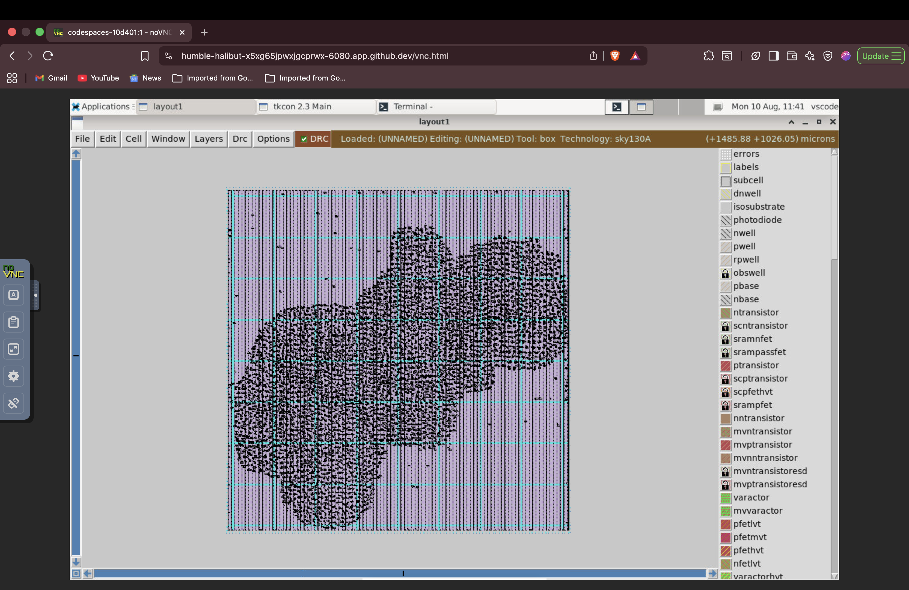
**Legally Placed Components:**


## Day 3 — Design and Characterisation of Library Cells using Magic & ngspice

### CMOS Inverter — SPICE Deck
To characterise a standard cell, we write a SPICE netlist describing the PMOS and NMOS transistors along with their W/L ratios, supply voltage, input stimulus, and load capacitance.

**Key parameters we extract from simulation:**
*   **Rise time** — 20% to 80% of output rising edge
*   **Fall time** — 80% to 20% of output falling edge
*   **Propagation delay** — 50% input to 50% output

### Detailed 16-Mask CMOS Fabrication Process
The physical fabrication of a CMOS integrated circuit relies on 16 photolithography masks to define active regions, wells, gates, implants, contacts, and multi-layer interconnections:

1. **Mask 1 — Active Region (Substrate / LOCOS):** Defines the active silicon regions where NMOS and PMOS transistors will be built, separating them using Local Oxidation of Silicon (LOCOS) or STI (Shallow Trench Isolation).
2. **Mask 2 — N-Well:** Defines the N-well regions on the P-substrate to house the PMOS transistors.
3. **Mask 3 — P-Well:** Defines the P-well regions (in a twin-tub process) to optimize NMOS threshold voltages.
4. **Mask 4 — Polysilicon Gate Patterning:** Patterns the deposited polysilicon layer to form the gate electrodes for both NMOS and PMOS transistors.
5. **Mask 5 — N- Select (Lightly Doped Drain - N- LDD):** Implants a low-concentration n-type dopant near the NMOS gate edges to mitigate hot-carrier effects.
6. **Mask 6 — P- Select (Lightly Doped Drain - P- LDD):** Implants a low-concentration p-type dopant near the PMOS gate edges.
7. **Mask 7 — N+ Source/Drain Implantation:** Defines and heavily implants the $N^+$ regions for the NMOS source/drain terminals and N-well body contacts.
8. **Mask 8 — P+ Source/Drain Implantation:** Defines and heavily implants the $P^+$ regions for the PMOS source/drain terminals and P-substrate body contacts.
9. **Mask 9 — Contact Vias (Contacts to Gate/Active):** Opens contact windows through the Inter-Level Dielectric (ILD) down to the polysilicon gates and $N^+/P^+$ active regions.
10. **Mask 10 — Metal 1 Routing:** Patterns the first metal layer (Metal 1 / Local Interconnect) to connect internal standard cell transistors.
11. **Mask 11 — Via 1:** Defines vertical connection cuts (Via 1) through the dielectric between Metal 1 and Metal 2 layers.
12. **Mask 12 — Metal 2 Routing:** Patterns the second metal layer for inter-cell routing and distribution.
13. **Mask 13 — Via 2:** Defines connection cuts (Via 2) between Metal 2 and higher-level metal layers.
14. **Mask 14 — Metal 3 / Top Metal:** Patterns the upper metal layer, commonly used for global power ($V_{DD}$) and ground ($V_{SS}$) bus routing.
15. **Mask 15 — Terminal / Pad Definition:** Opens access cuts through the top passivation layer to allow bonding wire connections to the I/O pads.
16. **Mask 16 — Passivation / Protective Layer:** Patterns the final glass passivation layer ($Si_3N_4$ / $SiO_2$) to protect the entire die from moisture, mechanical damage, and contamination.

### Lab — Cloning and Characterising a Custom Inverter Cell

#### Step 1: Clone the Custom Cell Repository & Launch Magic
Navigate to your OpenLane workspace, pull the custom cell repository, copy the technology file, and open the physical layout.

```bash
cd ~/Desktop/OpenLane
git clone [https://github.com/nickson-jose/vsdstdcelldesign.git](https://github.com/nickson-jose/vsdstdcelldesign.git)
cd vsdstdcelldesign

# Copy the Sky130 tech file into the local directory
cp /home/vscode/.ciel/sky130A/libs.tech/magic/sky130A.tech .

# Launch Magic to view the custom inverter layout
magic -T sky130A.tech sky130_inv.mag &
```
**Custom Inverter Layout View in Magic:**


**Inspecting Layout Selections:**
<br>
<br>


#### Step 2: Extract the SPICE Netlist
Once Magic and the white `tkcon` console window are open, run these commands inside the `tkcon` window to extract the parasitics and generate the netlist:

```tcl
extract all
ext2spice cthresh 0 rthresh 0
ext2spice
```
**Extraction Output in tkcon Console:**


#### Step 3: Modify the SPICE Netlist (`sky130_inv.spice`)
Head back to your terminal and open the generated netlist in `nano`:

```bash
nano sky130_inv.spice
```
**Initial SPICE Netlist Generated Before Modifications:**


Edit the file so it matches this exact configuration:

```spice
* SPICE3 file created from sky130_inv.ext - technology: sky130A

.option scale=0.01u
.include ./libs/pshort.lib
.include ./libs/nshort.lib

M1000 Y A VPWR VPWR pshort w=37 l=23
+ ad=1443 pd=152 as=1517 ps=156
M1001 Y A VGND VGND nshort w=35 l=23
+ ad=1435 pd=152 as=1365 ps=148
VDD VPWR 0 3.3V
VSS VGND 0 0V
Va A VGND PULSE(0V 3.3V 0 0.1ns 0.1ns 2ns 4ns)
C0 A Y 0.05fF
C1 Y VPWR 0.11fF
C2 A VPWR 0.07fF
C3 Y 0 0.24fF
C4 VPWR 0 0.59fF

.tran 1n 20n

.control
run
.endc
.end
```


#### Step 4: Run the Simulation and Plot Waveforms
Execute the `ngspice` simulation engine on your modified netlist:

```bash
ngspice sky130_inv.spice
```

Once the simulation completes and drops you at the interactive prompt (`ngspice 1 ->`), type the plotting command to view your transient response waveforms:

```spice
plot y a
```


#### Step 5: Characterisation Parameters & Simulation Waveforms
After executing the simulation in `ngspice`, the transient response waveforms are analyzed to extract precise timing metrics such as rise time, fall time, and cell propagation delay.

**1. Rise Time Analysis (20% to 80%):**


**2. Fall Time Analysis (80% to 20%):**


**3. Propagation Delay Analysis (50% input to 50% output):**


#### Timing Calculations from Simulation Waveforms

From the waveform, measure rise time, fall time, and propagation delay values:

* **Rise transition time calculation:**
  * Time at 20% output (660 mV) = 2.16182 ns
  * Time at 80% output (2.64 V) = 2.20323 ns
  * **Rise transition time** = 2.20323 ns - 2.16182 ns = **0.04141 ns (or 41.41 ps)**

* **Fall transition time calculation:**
  * Time at 80% output (2.64 V) = 4.04000 ns
  * Time at 20% output (660 mV) = 4.06819 ns
  * **Fall transition time** = 4.06819 ns - 4.04000 ns = **0.02819 ns (or 28.19 ps)**

* **Propagation delay calculation (Rise):**
  * Input transition 50% time = 2.14993 ns
  * Output transition 50% time = 2.18449 ns
  * **Rise Propagation delay** = 2.18449 ns - 2.14993 ns = **0.03456 ns (or 34.56 ps)**

* **Propagation delay calculation (Fall):**
  * Input transition 50% time = 4.04882 ns
  * Output transition 50% time = 4.05426 ns
  * **Fall Propagation delay** = 4.05426 ns - 4.04882 ns = **0.00544 ns (or 5.44 ps)**

### Lab — Analyzing Layout Errors and DRC Verification

#### Step 1: Navigating and Inspecting the Test Directory
First, we list the contents of the directory to verify the test files and lab archives containing intentionally modified or error-prone layouts.

```bash
tar xfz drc_tests.tgz
cd drc_tests
ls -la
```

**Directory Listing:**
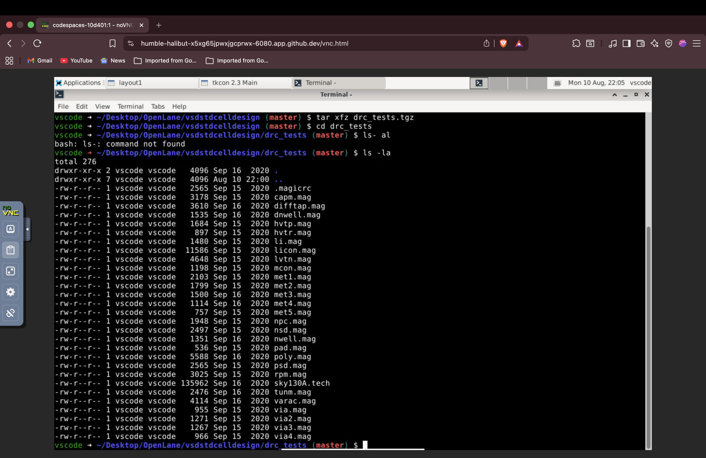

#### Step 2: Launching Magic with X11 Display
We open the Magic layout tool using the X11 display driver to properly render the graphical interface and load the design files.

```bash
magic -d X11
```

**Magic Open File Dialog:**
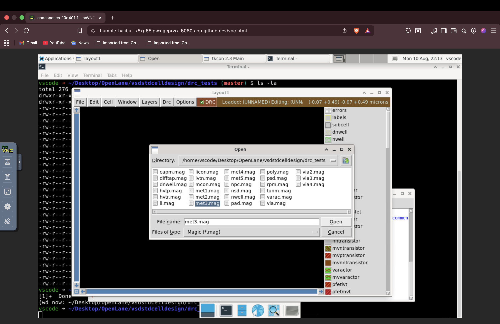

#### Step 3: Loading the Layout (`met3.mag`)
We browse and load the `met3.mag` layout file inside the Magic environment to examine standard routing and layer structures.

```bash
# Within Magic GUI or command prompt:
# File -> Open -> select met3.mag
```

**Loaded Layout View (`met3`):**
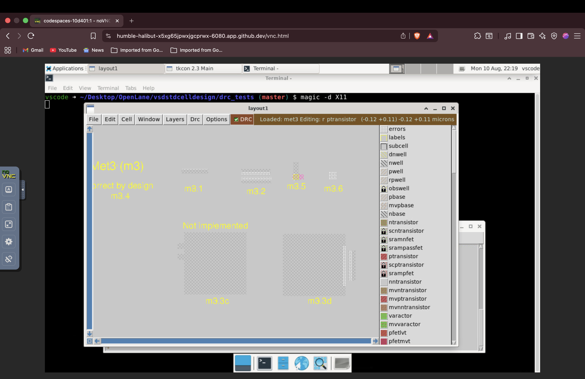

#### Step 4: Running DRC Analysis and Checking Violations (`drc why`)
To understand why specific layout errors or spacing violations are flagged by the tool, we query the error definitions interactively using the TkCon console.

```tcl
drc why
```

**DRC Verification & Error Analysis:**
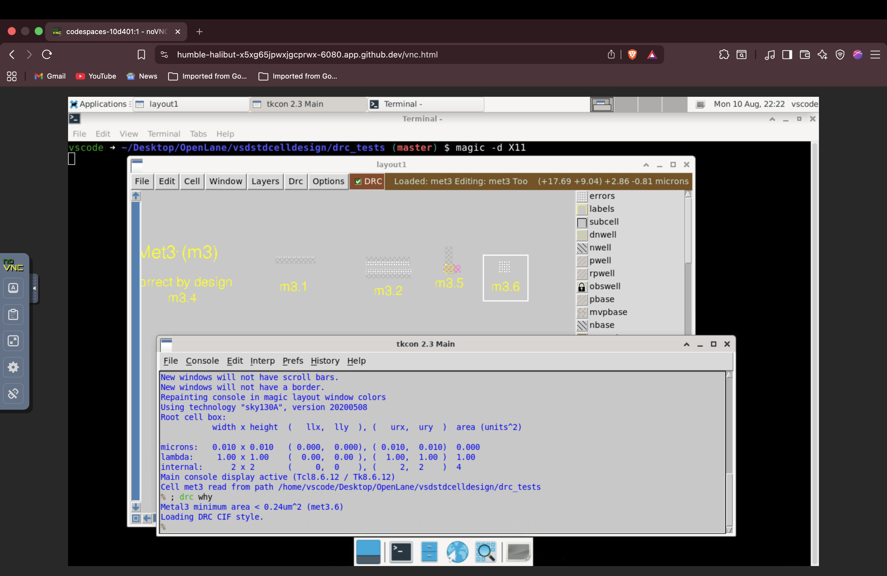

## Poly Resistor DRC Updates (poly.9)
Updated the SkyWater 130nm technology file (`sky130A.tech`) to properly implement missing Design Rule Checks (DRC) for poly resistors. 

**Key Changes:**
* **P+ Poly Resistors (`xhrpoly`, `uhrpoly`):** Implemented a 480-unit spacing rule to all diffusion layers (`alldiff`) and all non-resistor poly layers (`allpolynonres`), logging a touching_illegal constraint.
* **N+ Poly Resistors (`npres`):** Corrected a wildcard bug by changing the spacing constraint target from `*poly` to `allpolynonres`.
* **Verification:** Successfully loaded the patched tech file into Magic VLSI and validated the custom `poly.9` error messages against the `poly.mag` test layout using the TkCon console.

**1. Editing Poly Rules in Vim**


---

## Poly Resistor DRC Verification & CIF Layer Analysis
Following the `sky130A.tech` updates, physical verification was performed using Magic VLSI.

**Lab Progress:**
* **Test Structure Creation:** Utilized trackpad macros and the TkCon console to manually draw and copy poly resistor test structures in `poly.mag`.
* **Layer Painting:** Applied `ndiff`, `pdiff`, and `nwell` layers to the canvas to isolate the components and test the new `alldiff` spacing constraints.
* **DRC Validation:** Successfully cleared `poly.9` errors by manipulating block spacing and running `drc check`.
* **CIF Boolean Layers:** Loaded `nwell.mag` to begin testing Deep N-Well rules, utilizing commands like `cif see dnwell_shrink` and `cif see nwell_missing` to visualize generated Boolean layers.

**2. Initial Poly DRC Layout**


**3. Copying the Poly Resistors**


**4. Painting Diffusion and N-Well**


**5. Checking Poly DRC Errors**


**6. Poly Rule Verification Complete**


---

## Custom DRC Rule Implementation: N-Well Taps
Following the CIF Boolean layer analysis, custom rules were written and integrated into the PDK to strictly enforce well tap requirements.

**Lab Progress:**
* **Tech File Modification:** Edited `sky130A.tech` using Vim to define new `nwell_tapped` and `nwell_untapped` Boolean layers. 
* **Custom DRC Rule:** Added a strict DRC rule within the `# NWELL` section to flag any N-Well missing a valid tap contact as a violation (`nwell.4`).
* **Rule Activation:** Reloaded the technology file in Magic and executed `drc style drc(full)` to activate the newly written custom rules.
* **Physical Verification:** Validated the rule by successfully triggering the `DRC=11` error on an isolated N-Well, and subsequently resolving the missing tap error by painting an N-Substrate Contact (`nsc`) inside the well.

**7. Loading the N-Well Layout**


**8. Running CIF Boolean Commands**


**9. Adding N-Well Missing Tap Rule**


**10. Testing Full DRC Style**


**11. Placing the N-Well Tap Contact**


## Day 4 — Pre-Layout Timing Analysis and Clock Tree Synthesis

### LEF Files and Standard Cell Port Guidelines
Before integrating a custom cell into the OpenLANE flow, a valid LEF file is required to define its physical boundaries, pin locations, and metal layers. Standard cell port definitions must adhere to two critical rules:
* All input and output ports must precisely align with the intersection of the horizontal and vertical routing tracks.
* The cell's width and height must be odd multiples of the horizontal and vertical track pitches, respectively.

### Static Timing Analysis (STA) Concepts
STA is essential for verifying circuit timing before physical routing. The fundamental check for setup timing is:
**Setup Slack = Data Required Time - Data Arrival Time** *(Slack must be ≥ 0)*

To ensure a robust design, STA accounts for several key sources of uncertainty:
* **OCV (On-Chip Variation):** Accounts for local process, voltage, and temperature variations across the die, modeled using specific derate factors.
* **Clock Uncertainty:** Specific margins added to timing paths to account for expected clock jitter and skew.
* **CRPR (Clock Reconvergence Pessimism Removal):** Eliminates artificial pessimism in timing reports when the launch and capture clock paths share common buffers.

### Clock Tree Synthesis (CTS)
The goal of CTS is to build a balanced distribution network of clock buffers to deliver the clock signal across the entire chip while minimizing skew. Crucial steps after running CTS include:
* **Re-evaluating Hold Timing:** CTS physically inserts buffers into the design, adding real delay that can introduce new hold violations.
* **Re-verifying Setup Timing:** The actual physical clock paths are now established (replacing ideal pre-layout clocks), requiring a final setup check.

---

### Lab — Custom Cell Integration and STA with OpenSTA

## Standard Cell LEF Generation & OpenLane Integration

To ensure the custom `sky130_vsdinv` cell can be successfully routed by the automated place-and-route tools, its ports and boundaries were meticulously aligned to the standard routing grid before extraction and integration into the PicoRV32a design.

### 1. Identifying Routing Grid Values

* Analyzed the `tracks.info` file within the `sky130_fd_sc_hd` PDK to extract the `li1` layer X and Y grid spacing (`0.46`, `0.34`) and offsets (`0.23`, `0.17`).

### 2. Applying the Custom Grid in Magic

* Executed the custom grid parameters (`grid 0.46um 0.34um 0.23um 0.17um`) via the TkCon console to overlay the routing tracks onto the Magic workspace.

### 3. Grid Alignment Verification

* Visually verified that the input and output ports of the standard cell align precisely with the routing grid intersections to guarantee routing accessibility.

### 4. Bounding Box Measurement


* Utilized the `box` tool and console command to confirm the standard cell's width is an exact multiple of the X-grid pitch and the height matches the Y-grid boundaries. 

### 5. Port Definition

* Configured the `A` and `Y` labels as functional ports using Magic's `texthelper` GUI, enabling accurate LEF extraction for the synthesis tool.


## Day 4: Pre-Clock Tree Synthesis STA and Clock Tree Synthesis (CTS)

### 1. Custom Timing Constraints (SDC) Setup
Creating the `my_base.sdc` file to manually define the clock period, I/O delays, driving cells, and output capacitive loads for precise timing analysis.
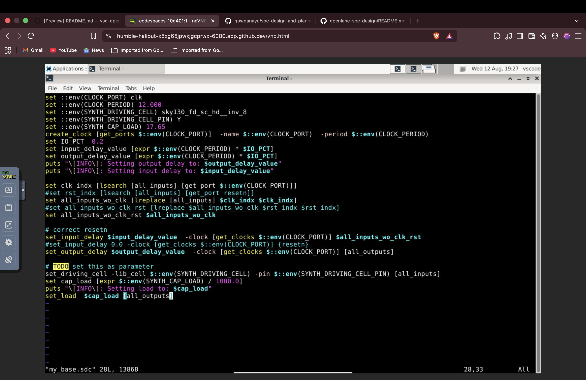

### 2. Pre-CTS Static Timing Analysis (STA)
Configuration and execution of OpenSTA for pre-CTS timing sign-off, utilizing the custom SDC definitions.
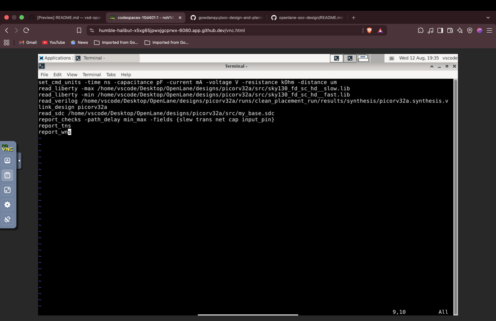

### 3. Placement Visualization in Magic
Full layout view of the `picorv32a` core after global and detailed placement.
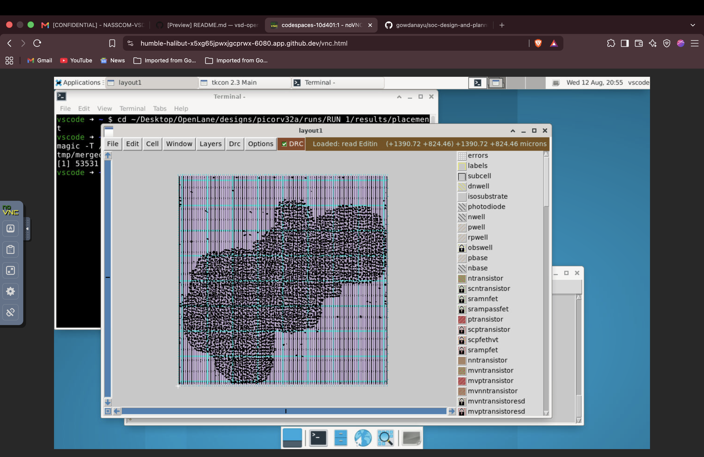

### 4. Standard Cell Abutment and Power Rails
Zoomed-in view verifying standard cell abutment and the precise alignment of `VPWR` and `VGND` rails.
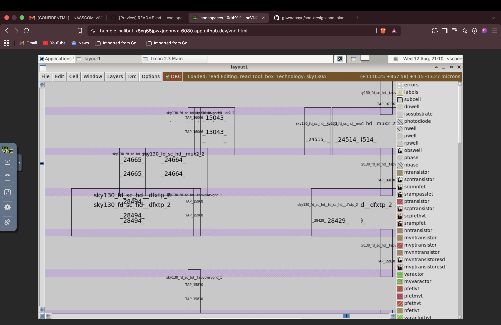

### 5. Custom Cell Internal Connectivity
Expanded view (`expand` command) in Magic showing the internal metal layers and routing of the custom inverter cell.
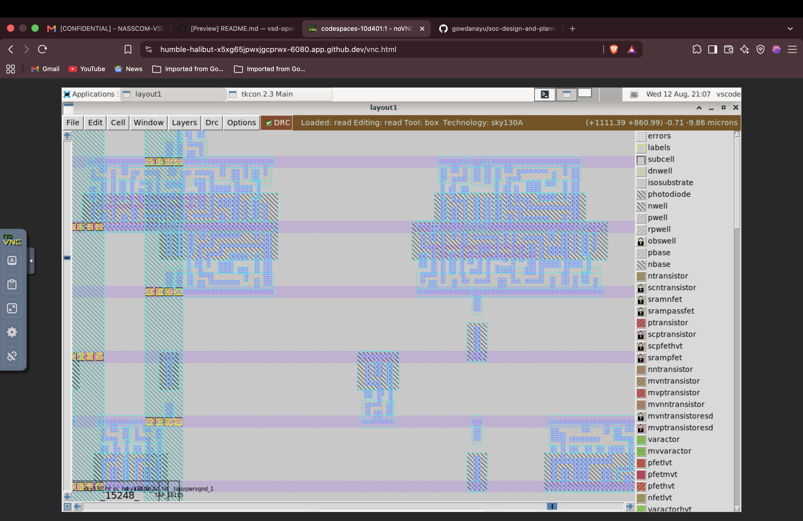
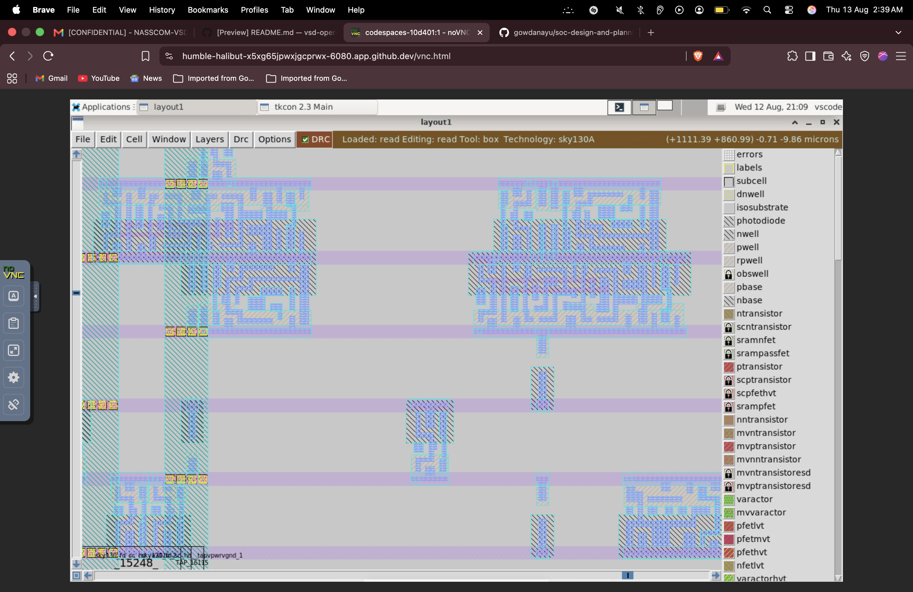

### 6. Clock Tree Synthesis (CTS)
Execution of TritonCTS in the OpenLane flow to build the clock distribution network.
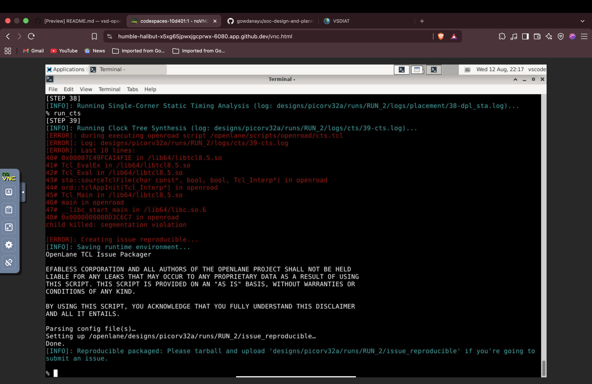

---

## Day 5: Final RTL to GDSII – Routing & Timing Sign-Off

### The Two-Stage Routing Architecture
In the OpenLane flow, physical routing is divided into two distinct phases to manage complexity:
* **Global Routing (FastRoute):** The tool partitions the chip design into broader routing grids and calculates estimated, congestion-aware paths for all nets. It focuses on the macroscopic scale rather than exact physical design rules.
* **Detailed Routing (TritonRoute):** Utilizing the rough guides established in the global phase, this step lays down the actual physical wire segments, vias, and metal layers. It ensures strict adherence to all foundry Design Rule Checks (DRC).

### Lab Execution: Power Distribution & Routing
To generate the power grid and physically route the standard cells, run the following commands within the OpenLane prompt:

**1. Generate the Power Distribution Network (PDN):**
```tcl
gen_pdn
```

**2. Execute the Two-Stage Routing Process:**
```tcl
run_routing
```

### Routing Execution & Verification

**1. Power Distribution Network (PDN) & Detailed Routing**
Terminal output showing the successful execution of `gen_pdn` to build the power grid, followed by Global and Detailed Routing (`run_routing`).
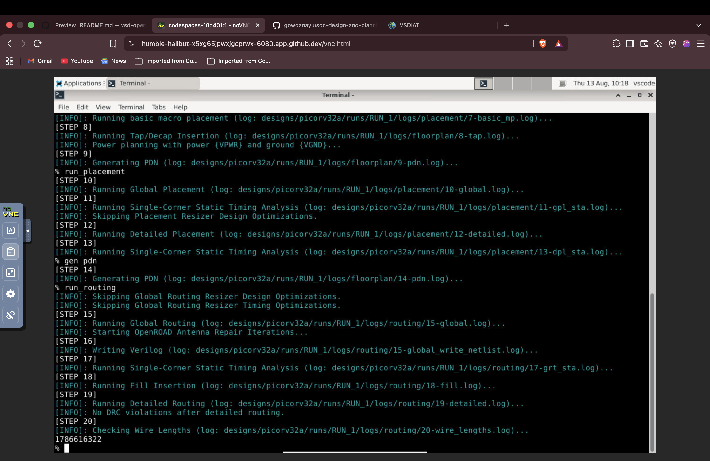

**2. Routing Results Extraction**
Verification of the generated routing files (including the `.def` and `.odb` files) in the `results/routing/` directory.
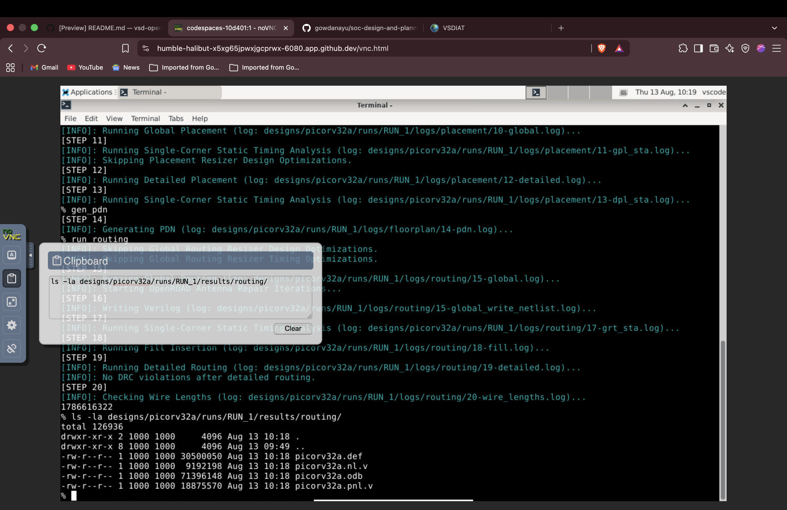

**3. Fully Routed Design in Magic**
Macro-level visualization of the completely routed `picorv32a` chip in Magic after `run_routing` completion.
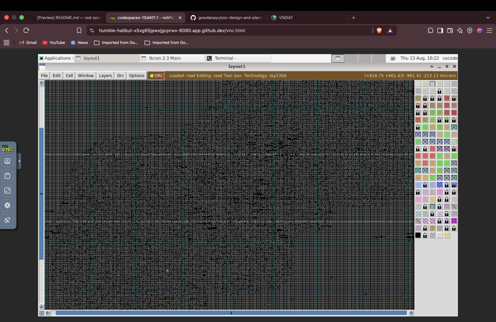

**4. Detailed Routing & DRC Verification**
Zoomed-in layout view showing the detailed physical routing tracks, via placements, and overlapping power distribution geometry.


### Parasitic Extraction & Post-Route STA
Once detailed routing is complete, the physical wires introduce real-world electrical delays (resistance and capacitance). To ensure the design functions correctly:
* These physical characteristics are extracted into a **SPEF (Standard Parasitic Exchange Format)** file.
* The tool then back-annotates this realistic parasitic data into the netlist to perform a final **Post-Route STA**. This guarantees that the fully routed physical design still securely meets all setup and hold timing constraints before sign-off.

### Common Routing Violations to Monitor:
* **Minimum Spacing Violations:** Occurs when two wires on the same metal layer are placed closer than the foundry's minimum design rules allow.
* **Antenna Violations:** Happens when excessively long metal traces accumulate static charge during the plasma etching process, which can discharge and permanently destroy the transistor's gate oxide.
  * *Solution:* Resolve by inserting antenna diodes near the gate or utilizing jumper vias to transition the route to a higher metal layer.

---

## 🛠 Tools & Environment

| Tool | Purpose |
| :--- | :--- |
| **OpenLANE** | Automated RTL-to-GDSII physical design flow |
| **Yosys** | Logic synthesis and technology mapping |
| **OpenROAD** | Floorplanning, Placement, CTS, and Global Routing |
| **Magic** | VLSI Layout tool for DRC, LVS, and visual inspection |
| **OpenSTA** | Static Timing Analysis (STA) for timing sign-off |
| **ngspice** | Transistor-level SPICE simulation |
| **TritonRoute** | Detailed physical routing |
| **Netgen** | LVS (Layout vs. Schematic) checking |
| **SkyWater 130nm** | Open-source foundry PDK (Process Design Kit) |

---

## 🧠 Key Learnings

* Successfully navigated the complete RTL-to-GDSII physical design flow utilizing an entirely open-source ASIC toolchain.
* Gained hands-on, practical experience executing floorplanning, power planning, standard cell placement, CTS, and routing for the `picorv32a` RISC-V processor core.
* Mastered the characterization of custom standard cells (e.g., custom inverters) and their seamless integration into a larger automated physical design flow.
* Deepened practical understanding of Static Timing Analysis (STA) constraints, including setup/hold slack, On-Chip Variation (OCV), and Clock Reconvergence Pessimism Removal (CRPR) using OpenSTA.
* Analyzed the impact of real-world physical wire delays on timing sign-off through post-route SPEF (Standard Parasitic Exchange Format) extraction.

---

## 🙌 Acknowledgements

A massive thank you to *Kunal Ghosh* (Co-founder, VSD Corp. Pvt. Ltd.) for curating such a well-structured, hands-on workshop. Taking a real RISC-V CPU from raw RTL all the way to a manufacturable GDSII layout using exclusively open-source tools has been an incredible learning experience. 

* **Kunal Ghosh** — Co-founder, VSD (VLSI System Design)
* **NASSCOM** — For facilitating this specialized workshop program

---

## 📚 References

* [VSD SoC Design Workshop](https://www.vlsisystemdesign.com/)
* [OpenLANE GitHub Repository](https://github.com/The-OpenROAD-Project/OpenLane)
* [SkyWater Sky130 PDK](https://github.com/google/skywater-pdk)
  
